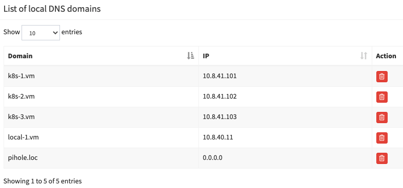

# DNS
### DNS Entries
| DOMAIN | I.P. | Description |
| ------ | ---- | ----------- |
| pihole.loc | 0.0.0.0 | DNS server/sinkhole |
| local-1.vm | 10.8.40.11 | Proxy node (public network) |
| k8s-1.vm | 10.8.41.101 | Proxy node (private network) |
| k8s-2.vm | 10.8.41.102 | Proxy node (private network) |
| k8s-3.vm | 10.8.41.103 | Proxy node (private network) |

### pi-hole Sample DNS entries
