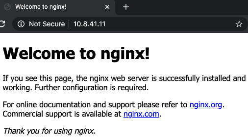
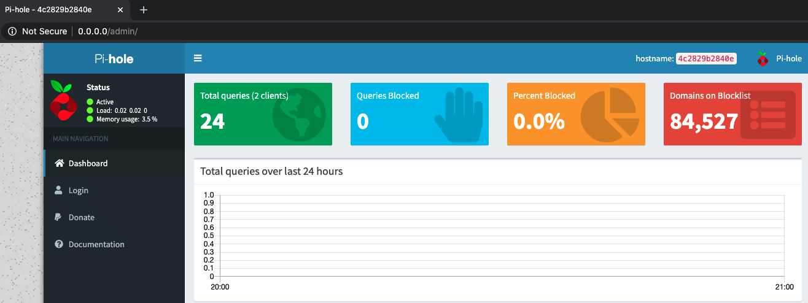
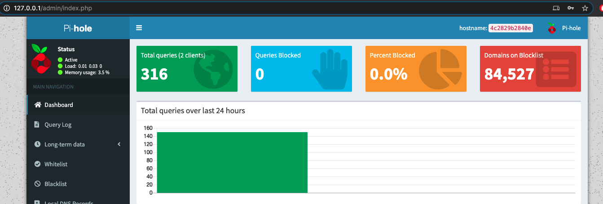

# NODES
* Only proceed if [requirements](./REQUIREMENTS.md) has been met.
* Unique VM's are to be deployed consisting of a kubernetes cluster and a proxy node

## Prerequisite - VM specifications
* The VM specifications are stated in [vagrant_variables.yaml](../platform/vagrant/vagrant_variables.yaml)
* Refer to the [infrastructure](../INFRASTRUCTURE.md) document for the default specifications

### Field descriptions
#### global
This block contains details propagated to all managed virtual machines
| Field | Description |
| ----- | ----------: |
| api_version | Api version used by vagrant |
| network | Contains network rules intended to be propagated across all VM's |
| network.subnet | Subnet of all the VM's |
| plugins | Global plugin list |

#### nodes
Contains details specific to a node or group of nodes
| Field | Description |
| ----- | ----------: |
| cpu| number of cores allocated to vm(s) |
| bootstrap | shell commands to be executed post VM deployment |
| disk | Unformatted disk(s) block to be attached against VM(s) |
| disk.instances | number of disk(s) to be created and attached |
| disk.size | size of disk(s) |
| gui | GUI enabled/disabled when VM(s) are provisioned |
| instances | Number of VM(s) to be provisioned in the VM group |
| memory | Allocated RAM |
| mounts | Physical host machine path to be mounted on guest (VM) |
| mounts[ 0..n ].host | Host path |
| mounts[ 0..n ].guest | Guest path |
| network | Host part (last 3 digits) with a rang of [1-254] of a subnet |
| node_prefix | Prefix of the name allocated to the VM |
| os | Vagrantbox image to be used for the VM group |

## Vagrant input validation
```bash
# Validate Vagrant configuration
make validate_vm

Vagrant has detected project local plugins configured for this
project which are not installed.

  vagrant-disksize, vagrant-sshfs
Install local plugins (Y/N) [N]: Y  'THIS IS A PROMPT!!!'
Installing the 'vagrant-disksize' plugin. This can take a few minutes...
Fetching vagrant-disksize-0.1.3.gem
Installed the plugin 'vagrant-disksize (0.1.3)'!
Installing the 'vagrant-sshfs' plugin. This can take a few minutes...
Fetching win32-process-0.8.3.gem
Fetching vagrant-sshfs-1.3.5.gem
Installed the plugin 'vagrant-sshfs (1.3.5)'!


Vagrant has completed installing local plugins for the current Vagrant
project directory. Please run the requested command again.
make: *** [validate_vm] Error 255 'Vagrant exits with 255'

# As instructed, re-execute the validation
make validate_vm
Validate Vagrant Specification(s):  ./platform/vagrant/vagrant_variables.yaml
There are errors in the configuration of this machine. Please fix
the following errors and try again:

vm:
* The host path of the shared folder is missing: ./data/nginx/certs
* The host path of the shared folder is missing: ./data/sharedfolder

# The error above is caused by specified folders added 
#   to .gitignore. They are excluded due to contents 
#   being unwanted to be pushed upstream

# The error is fixed by executing the below
make bootstrap_mounts
Initialising path:./platform/vagrant/./data/sharedfolder
Updating Permission of SSHFS mount:./platform/vagrant/./data/sharedfolder
Initialising path:./platform/vagrant/./data/nginx/certs
Updating Permission of SSHFS mount:./platform/vagrant/./data/nginx/certs

# Now that the path requirements are met, reexecute the vagrant validation
make validate_vm
Validate Vagrant Specification(s):  ./platform/vagrant/vagrant_variables.yaml
Vagrantfile validated successfully.
```
## Provisioning
```bash
make up
Provisioning Vagrant VM:  ./platform/vagrant
cd  ./platform/vagrant && vagrant up
Bringing machine 'k8s-1' up with 'virtualbox' provider...
Bringing machine 'k8s-2' up with 'virtualbox' provider...
Bringing machine 'k8s-3' up with 'virtualbox' provider...
Bringing machine 'local-1' up with 'virtualbox' provider...
==> k8s-1: Box 'ubuntu/bionic64' could not be found. Attempting to find and install...
    k8s-1: Box Provider: virtualbox
    k8s-1: Box Version: >= 0
==> k8s-1: Loading metadata for box 'ubuntu/bionic64'
    k8s-1: URL: https://vagrantcloud.com/ubuntu/bionic64
==> k8s-1: Adding box 'ubuntu/bionic64' (v20200724.0.0) for provider: virtualbox
    k8s-1: Downloading: https://vagrantcloud.com/ubuntu/boxes/bionic64/versions/20200724.0.0/providers/virtualbox.box
Download redirected to host: cloud-images.ubuntu.com
Progress: 82% (Rate: 822k/s, Estimated time remaining: 0:02:12)

# Once the template images are downloaded, each of the VM's are bootstrapped with the shell provisioner.
# Key output involves the installation and configuration of nginx and nfs-kernel-server resing in the proxy node.
    local-1: Getting Private key
    local-1: mv: 
    local-1: failed to preserve ownership for '/etc/letsencrypt/live/server.crt'
    local-1: : Permission denied
    local-1: mv: 
    local-1: failed to preserve ownership for '/etc/letsencrypt/live/server.csr'
    local-1: : Permission denied
    local-1: mv: 
    local-1: failed to preserve ownership for '/etc/letsencrypt/live/server.key'
    local-1: : Permission denied

# The Preservation of the permission isn't necessary. 
# The important bit is to see the files present on the relative Host path.
ls -l platform/vagrant/data/nginx/certs/
total 24
-rw-r--r--  1 jesmigel  staff  1233 25 Jul 20:06 server.crt
-rw-r--r--  1 jesmigel  staff  1013 25 Jul 20:06 server.csr
-rw-r--r--  1 jesmigel  staff  1675 25 Jul 20:06 server.key

# Upon completion of the VM provisioning, the dns docker-compose is brought up
# Completion is indicated by polling for the docker-compose status
'NOTE: If a port collision exist, it is necessary to kill the processes that causes the port collision'
 Name    Command       State                                                      Ports                                                
---------------------------------------------------------------------------------------------------------------------------------------
pihole   /s6-init   Up (healthy)   0.0.0.0:443->443/tcp, 0.0.0.0:53->53/tcp, 0.0.0.0:53->53/udp, 0.0.0.0:67->67/udp, 0.0.0.0:80->80/tcp
```


## Post deployment validations
```bash
# Infrastructure status
make status
Vagrant Status in:  ./platform/vagrant
cd  ./platform/vagrant && vagrant status
Current machine states:

k8s-1                     running (virtualbox)
k8s-2                     running (virtualbox)
k8s-3                     running (virtualbox)
local-1                   running (virtualbox)

This environment represents multiple VMs. The VMs are all listed
above with their current state. For more information about a specific
VM, run `vagrant status NAME`.
cd  ./platform/compose && docker-compose ps
 Name    Command       State                                                      Ports                                                
---------------------------------------------------------------------------------------------------------------------------------------
pihole   /s6-init   Up (healthy)   0.0.0.0:443->443/tcp, 0.0.0.0:53->53/tcp, 0.0.0.0:53->53/udp, 0.0.0.0:67->67/udp, 0.0.0.0:80->80/tcp

# IMPORTANT!
#   Procure the autogenerated password for the pihole dashboard
make logs_dns | grep password
pihole    | Assigning random password: ********
pihole    | Setting password: ********
pihole    |   [✓] New password set
```

## Browser Output
### NGINX


### PiHole (DNS Server/Sinkhole) - Unauthenticated



### PiHole (DNS Server/Sinkhole) - Authenticated
